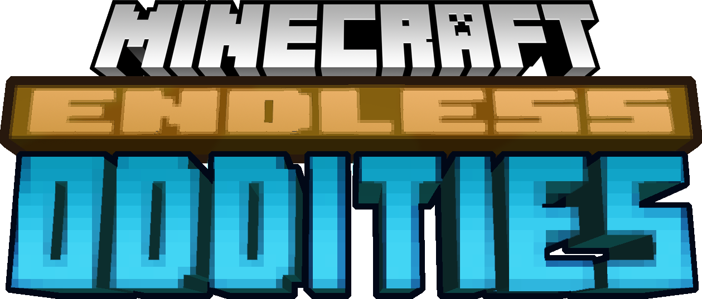

**Discord server:** [link](https://discord.gg/YXm7vSBjdW)

..is a modpack that is essentially a extended Fork of [Euphoric Curiosity] which more focuses on giving Vanilla+ with tad bit additional randomness mixed in. Other than the vanilla aspect of adding the partial additions caves & cliff world height and features, This modpack is focused to give the player a streamline experience as much as possible following my own take on vanilla+ concept. An attempt to keep things as simple to the user where possible, such as in crafting recipes, progression flow and etc.

Be wary, this pack is still a **work in progress!** While it should be possible to make a whole playthrough with this pack, instability should be expected. there are some elements not yet finished notably the overview guide book. mods chosen for this modpack will hopefully flow into each other making it easy to get used to new ideas and concepts.

## Download / Installation

The modpack is currently only available as a **self-updating** [MultiMC] instance.

1. Download and install [MultiMC] if you don't have it already.
2. download the latest release.
3. create a new instance on [MultiMC], select "Import from zip" and browse to the zip.
4. Download [packwiz-Installer-bootstrap], paste the jar file in in MultiMC instance (in /.minecraft/)
5. Start the game! At first launch, [packwiz] downloads all the config files and mods for you. When the modpack updates, the MultiMC instance will also update by itself with newly added / removed / updated mods, changed recipes, etc.

as per guidelines, I will not be exporting the modpack publicly in the [curseforge] format as it may or may not violate licenses on distribution on any mod that is not available on [curseforge] database(this also means it won't be available on [curseforge] directly). If you so must packwiz is capable of exporting this modpack in the [curseforge] format, i suggest doing it yourself by:

1. clone this repo to your local directory
2. get [packwiz] & put in directory of the repo.
3. open cmd in that location.
4. run `packwiz curseforge export`

## Development

Requires the [packwiz] tool, so be sure to download it first.

Steps to update the modpack:

- Run `packwiz update --all` to update all mods to latest.
- Run `packwiz refresh` to update file index, necessary when modifying any files.
- Now you can create a commit and push to the repo.

If you want to do local testing:

- Modify MultiMC instance's "pre-launch command" to use:  
  `http://localhost:8080/pack.toml`
- Run `packwiz serve` to run a simple webserver.  
  Will also update index automatically on file changes.
- Launch the instance and it will pull changes from your local setup.

## Credits

- Credit goes to Comp500 for Development of [Packwiz] and its related tools, Indium and all the other amazing projects that makes this plausable.
- Credit to LiviiYS for the Development of [Euphoric Curiosity] that sparked this project.
- Thanks to Copygirl for her [Slime Skies] Modpack that allowed me to better learn how to set packwiz properly. Suggest checking it out pretty cool create modpack ngl.
- Special Thanks to all the mod authors that makes this possible. mod list can be found [here](misc/MODLIST.md)

[curseforge]: https://www.curseforge.com
[Euphoric Curiosity]: https://www.curseforge.com/minecraft/modpacks/euphoriccuriosity
[Minecraft]: https://minecraft.net/
[MultiMC]: https://multimc.org/
[packwiz]: https://github.com/comp500/packwiz
[packwiz-Installer-bootstrap]: https://github.com/comp500/packwiz-installer-bootstrap/releases
[Slime Skies]: https://github.com/copygirl/slime-skies/
